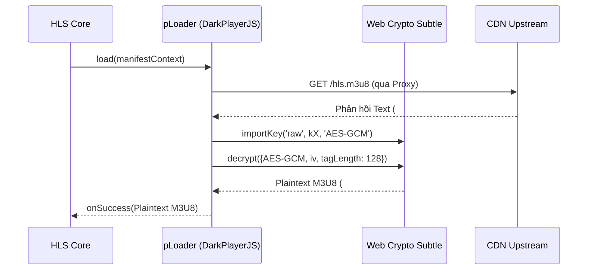
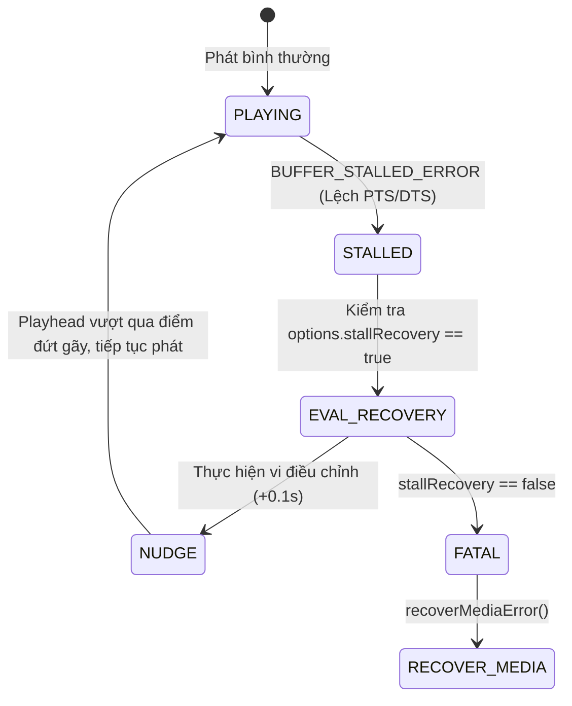
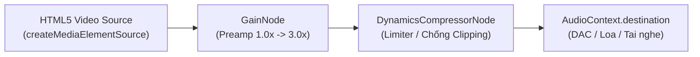

# Tài Liệu Thiết Kế Phương Án Xử Lý Luồng (Streaming Pipeline Architecture) - DarkPlayerJS

> **Phiên bản:** 1.4.0  
> **Tác giả:** Nguyễn Quốc Anh (`nguyenquocanhz`)  
> **Dự án:** [DarkPlayerJS (GitHub)](https://github.com/nguyenquocanhz/DarkPlayerJS)  
> **Mục tiêu:** Xử lý triệt để bài toán phát video HLS/M3U8 trên các hạ tầng máy chủ CDN phức tạp, có cơ chế Anti-Hotlinking, chặn CORS, bọc ngụy trang header TS-in-PNG, mã hóa AES-GCM và hiện tượng lệch PTS/DTS gây đơ hình.

---

## 1. Sơ Đồ Tổng Thể Luồng Xử Lý (End-to-End Pipeline Overview)

```mermaid
flowchart TD
    A["Đầu Vào Đa Hình Thức<br/>(Video Hash / Token StreamC / Link M3U8 / Local MP4)"] --> B{"Phân Loại Nguồn"}

    %% Nhánh MP4
    B -->|Local / Direct MP4| C["HTML5 Video Direct Feed<br/>(HTTP 206 Partial Content)"]

    %% Nhánh Hash / Token
    B -->|32-Char MD5 Hash| D["Ánh xạ CDN Endpoint<br/>jps14.hihihoho4.top/{hash}/hls.m3u8"]
    B -->|StreamC Token URL| E["DarkCrypto.decodeChunkedToken()<br/>(Ghép 4 Chunks Base64 -> Bóc JWT Inner)"]
    B -->|Upload18 Embed| F["Trích xuất PLAYER_CONFIG<br/>lấy link m3u8 gốc"]
    B -->|Direct M3U8| G["URL M3U8"]

    D --> H{"Kiểm Tra Host CDN"}
    E --> H
    F --> H
    G --> H

    %% Tầng Network Proxy
    H -->|Server có Anti-Hotlink / CORS| I["Streaming Bridge / Proxy<br/>(Referer Injection & M3U8 URL Rewriter)"]
    H -->|CORS Mở / Không Hotlink| J["Tải Trực Tiếp"]

    I --> K["HLS.js Core Engine"]
    J --> K

    %% Custom Loaders
    K --> L["pLoader (Playlist Interceptor)"]
    L --> M{"Có Header #ENC-AESGCM?"}
    M -->|Có| N["Web Crypto AES-GCM Decrypt<br/>(Key: kX, IV: Hex, Tag: 128-bit)"]
    M -->|Không| O["Manifest Parsing (Levels / Bitrate)"]
    N --> O

    O --> P["fLoader (Fragment Interceptor)"]
    P --> Q{"Byte đầu == 0x47?"}
    Q -->|Không (PNG Header Giả)| R["TS Sync-Byte Sanitizer<br/>(Cắt bỏ Header rác trước 0x47)"]
    Q -->|Đúng (Chuẩn MPEG-TS)| S["MPEG-TS Demuxer"]
    R --> S

    %% Transmuxing & Playback
    S --> T["Transmuxing -> ISO-BMFF (fMP4)"]
    T --> U["MediaSource Extensions (MSE)<br/>SourceBuffer.appendBuffer()"]
    U --> V["HTML5 Video Element"]

    %% Stall Recovery & Audio
    V --> W{"BUFFER_STALLED_ERROR?<br/>(Lệch Timestamp PTS/DTS)"}
    W -->|Phát hiện Treo| X["Stall Recovery Subsystem<br/>currentTime += 0.1s"]
    X --> V

    V --> Y["Web Audio Processing Pipeline"]
    Y --> Z1["GainNode (Boost 100% - 300%)"]
    Z1 --> Z2["DynamicsCompressorNode<br/>(Chống vỡ tiếng / Limiter)"]
    Z2 --> Z3["AudioContext.destination (Loa)"]
```

---

## 2. Chi Tiết Từng Tầng Trong Kiến Trúc

### 2.1. Tầng 1: Nhận Diện & Phân Giải Đầu Vào Đa Hình Thức (Source Resolution)

DarkPlayerJS hỗ trợ nạp đa dạng các định dạng nguồn phát mà không bắt buộc lập trình viên phải chuẩn bị sẵn link M3U8 trực tiếp:

| Định Dạng Đầu Vào | Nhận Diện Kỹ Thuật | Phương Án Chuyển Hóa (Transformation) |
| :--- | :--- | :--- |
| **Video Hash 32 Ký Tự** | Regex: `/^[a-f0-9]{32}$/i` | Tự động chuyển thành manifest HLS:<br/>`https://jps14.hihihoho4.top/{hash}/hls.m3u8` |
| **Token Chunked StreamC** | Chứa chuỗi base64 chia đoạn `eyJ0...` | Ghép 4 đoạn URL path thành 1 chuỗi Base64 hoàn chỉnh, giải mã JSON outer, bóc phần JWT payload inner để lấy trường `cdnPlaylistUrl` (`inner.r`) và mã hash (`inner.v`). |
| **Trang Nhúng Upload18 / Helvid** | Chứa `upload18.org/play/` | Tải trang qua proxy với `Referer: https://avdbapi.com/`, quét regex biến `window.PLAYER_CONFIG.m3u8` để trích xuất link playlist thực. |
| **Tệp MP4 Cục Bộ** | Đuôi `.mp4` hoặc path `/video/...` | Bỏ qua HLS Engine, chuyển thẳng vào `video.src` native, kích hoạt cơ chế HTTP 206 Partial Content để tua mượt mà. |

#### Thuật Toán Ghép & Giải Mã Token StreamC:
```javascript
decodeChunkedToken(chunkedUrlOrPath) {
  const parts = chunkedUrlOrPath.split('?')[0].split('/').filter(Boolean);
  const chunkIndex = parts.findIndex(p => p.startsWith('eyJ0'));
  if (chunkIndex === -1) return null;

  // Ghép 4 phân đoạn base64 liên tiếp
  const chunks = parts.slice(chunkIndex, chunkIndex + 4);
  const b64 = chunks.join('');
  const outer = JSON.parse(atob(b64));
  
  if (outer.t) {
    const jwtPayloadPart = outer.t.split('.')[0];
    const inner = JSON.parse(atob(jwtPayloadPart));
    return {
      outer,
      inner,
      cdnPlaylistUrl: inner.r,
      hash: inner.v
    };
  }
  return null;
}
```

---

### 2.2. Tầng 2: Vượt Rào Mạng, Anti-Hotlink & Anti-CORS (Network Bridge)

#### Bản chất rào cản:
Các CDN video lậu (như `hihihoho4.top`, `streamc.xyz`, `helvid.com`) áp dụng 2 lớp tường lửa:
1. **Kiểm tra Header `Referer`**: Từ chối phục vụ (HTTP 403 Forbidden) nếu `Referer` không xuất phát từ iframe được ủy quyền (ví dụ `https://embed14.streamc.xyz/`).
2. **Chính sách CORS của trình duyệt**: Trình duyệt chặn JavaScript của trang web đọc dữ liệu phản hồi nếu máy chủ thiếu header `Access-Control-Allow-Origin: *`.

#### Cơ chế xử lý của Streaming Bridge (Proxy / Cloudflare Worker):
1. **Nhận diện Referer mục tiêu tự động**:
   ```javascript
   function autoDeriveReferer(targetUrl) {
     if (targetUrl.includes('helvid.com')) return 'https://upload18.org/';
     if (targetUrl.includes('upload18.org')) return 'https://avdbapi.com/';
     if (targetUrl.includes('hihihoho4.top') || targetUrl.includes('streamc.xyz')) {
       const match = targetUrl.match(/[0-9]+/);
       const serverNum = match ? match[0] : '14';
       return `https://embed${serverNum}.streamc.xyz/`;
     }
     if (targetUrl.includes('amass1.top')) return 'https://embed.streamc.xyz/';
     return `${new URL(targetUrl).origin}/`;
   }
   ```
2. **Viết lại Playlist M3U8 (Manifest Rewriting)**:
   Khi nhận phản hồi M3U8 từ CDN gốc, Streaming Bridge không trả về nguyên bản mà duyệt từng dòng của playlist:
   - Các dòng comment (`#EXTINF`, `#EXT-X-KEY`...) được giữ nguyên.
   - Các dòng URI segment (`.ts`, `.png`) được viết lại thành:
     `/proxy?url={encodeURIComponent(segmentAbsUrl)}&referer={encodeURIComponent(referer)}`
   - Nhờ đó, 100% các request tải phân đoạn con sau đó đều đi qua Proxy và được gắn đúng `Referer`, triệt tiêu hoàn toàn lỗi 403 Forbidden.

---

### 2.3. Tầng 3: Giải Mã Manifest AES-GCM Bằng Web Crypto API (`pLoader`)

Nhiều cụm CDN cao cấp áp dụng mã hóa mức manifest nhằm giấu toàn bộ danh sách phân đoạn TS thực tế:
- Header trong M3U8: `#ENC-AESGCM iv={32 ký tự Hex}`
- Nội dung: 1 chuỗi mã hóa Base64 lớn.

DarkPlayerJS giải quyết vấn đề này tại tầng `pLoader` của HLS.js:
1. **Can thiệp callback `callbacks.onSuccess`** trước khi HLS.js phân tích cú pháp manifest.
2. Kiểm tra chuỗi `#ENC-AESGCM`:
   - Trích xuất `IV` (Initialization Vector) dạng Hex (12 hoặc 16 bytes).
   - Tách lấy chuỗi Payload Base64.
   - Khóa giải mã `kX`: Mặc định `2bb80d537b0da3e38bd30361aa85568a` (hoặc do lập trình viên cấu hình).
3. **Phần cứng Web Crypto tăng tốc**:
   - Tách 16 bytes cuối cùng của mảng byte mã hóa để làm **Authentication Tag** (`tagLength: 128`).
   - Sử dụng `window.crypto.subtle.importKey('raw', keyBytes, 'AES-GCM', false, ['decrypt'])`.
   - Thực thi `crypto.subtle.decrypt({ name: 'AES-GCM', iv: ivBytes, tagLength: 128 }, cryptoKey, ciphertextWithTag)`.
   - Chuyển `ArrayBuffer` đã giải mã thành UTF-8 String và gán ngược lại cho `response.data`.



---

### 2.4. Tầng 4: Tẩy Uế Byte TS & Cắt Bỏ Header Giả Mạo (`fLoader`)

Một kỹ thuật phổ biến của các server streaming là gắn đuôi `.png` hoặc chèn các byte header ảnh PNG giả (`89 50 4E 47 0D 0A 1A 0A`) vào đầu tệp MPEG-TS để lách qua các hệ thống tường lửa (DPI - Deep Packet Inspection).

Nếu đưa trực tiếp khối dữ liệu này vào bộ giải mã của trình duyệt, HLS demuxer sẽ ném lỗi nghiêm trọng `MALFORMED_DATA` và ngừng phát.

#### Thuật toán TS Sync-Byte Auto Sanitizer:
Chuẩn quốc tế ISO/IEC 13818-1 quy định mỗi gói tin Transport Stream (TS packet) phải có kích thước 188 bytes và luôn bắt đầu bằng **Sync Byte `0x47`** (ASCII 'G').

```javascript
fLoader: class extends Hls.DefaultConfig.loader {
  load(context, config, callbacks) {
    const originalOnSuccess = callbacks.onSuccess;
    callbacks.onSuccess = (response, stats, context) => {
      let buf = response.data;
      if (buf instanceof ArrayBuffer) {
        const u8 = new Uint8Array(buf);
        // Nếu byte đầu tiên không phải 0x47 (bị chèn header rác)
        if (u8.length > 0 && u8[0] !== 0x47) {
          const syncIdx = u8.indexOf(0x47);
          if (syncIdx !== -1) {
            // Cắt bỏ phần rác, chỉ giữ từ byte 0x47 trở về sau
            response.data = u8.subarray(syncIdx).buffer;
          }
        }
      }
      originalOnSuccess(response, stats, context);
    };
    super.load(context, config, callbacks);
  }
}
```

---

### 2.5. Tầng 5: Bộ Điều Phối Chống Đơ Lệch Khung Hình (PTS/DTS Stall Recovery)

#### Nguyên nhân gây đứng hình (Stall):
Trên các web lậu, video thường được ghép từ nhiều nguồn (quảng cáo chèn vào giữa, đoạn nối các tập). Điều này dẫn đến sự gián đoạn về mặt thời gian hiển thị (Presentation Time Stamp - PTS) và thời gian giải mã (Decode Time Stamp - DTS).
Hậu quả: Trình duyệt tải đầy bộ đệm (Buffer đầy 60 giây) nhưng video vẫn đứng hình tại một giây cụ thể, con trỏ Playhead không thể tự nhảy qua được điểm "đứt gãy".

#### Giải pháp vi điều chỉnh (Micro-Nudge Strategy):
DarkPlayerJS triển khai cơ chế lắng nghe trạng thái lỗi bộ đệm phi nghiêm trọng (Non-fatal error):



- Khi sự kiện `Hls.ErrorDetails.BUFFER_STALLED_ERROR` kích hoạt:
  ```javascript
  if (data.details === Hls.ErrorDetails.BUFFER_STALLED_ERROR && this.options.stallRecovery) {
    this.video.currentTime += 0.1;
    console.log('[DarkPlayerJS] Stalled buffer nudged forward +0.1s');
  }
  ```
- Bước nhảy siêu nhỏ `0.1s` (100ms) giúp đưa Playhead tiếp cận ngay khung hình tiếp theo có PTS hợp lệ, người xem hoàn toàn không nhận ra gián đoạn.

---

### 2.6. Tầng 6: Kiến Trúc Xử Lý Âm Thanh Nâng Cao (Web Audio Preamp Pipeline)

Các video trên internet thường xuyên gặp vấn đề âm lượng quá nhỏ (âm lượng gốc chỉ đạt 20-30%). Việc tăng thanh âm lượng của thẻ `<video>` lên 100% vẫn không đủ nghe.

DarkPlayerJS tích hợp một chuỗi xử lý tín hiệu số (DSP - Digital Signal Processing) dựa trên **Web Audio API**:



#### Các thông số của bộ nén động học (Dynamic Compressor Settings):
Để âm thanh khi tăng lên 200% - 300% không bị vỡ tiếng (Clipping distortion), DarkPlayerJS thiết lập các tham số kỹ thuật chuyên dụng cho âm thanh phim ảnh:

| Tham Số | Giá Trị Thiết Lập | Vai Trò & Tác Dụng |
| :--- | :--- | :--- |
| `threshold` | `-6.0 dB` | Ngưỡng bắt đầu nén: Tín hiệu vượt qua -6dB sẽ được kiểm soát chặt chẽ. |
| `knee` | `12.0 dB` | Vùng chuyển tiếp mượt mà giữa dải không nén và dải nén. |
| `ratio` | `8.0 : 1` | Tỷ lệ nén mạnh mẽ đối với các đoạn âm thanh bùng nổ (cháy nổ, thét lớn) để bảo vệ màng loa. |
| `attack` | `0.003 giây` (3ms) | Tốc độ phản ứng cực nhanh, triệt tiêu ngay lập tức hiện tượng méo tiếng biên độ lớn. |
| `release` | `0.25 giây` (250ms) | Thời gian nhả âm mượt mà, giúp duy trì độ tự nhiên của giọng nói hội thoại. |

---

## 3. Bảng Tổng Hợp Chiến Lược Phục Hồi Lỗi (Fault Tolerance Matrix)

| Loại Lỗi | Cấp Độ | Triệu Chứng | Biện Pháp Tự Động Phục Hồi (Auto-Remedy) |
| :--- | :--- | :--- | :--- |
| **`NETWORK_ERROR`** | Fatal | Mạng chập chờn, rớt kết nối segment CDN | Tự động gọi `hls.startLoad()` với cơ số lùi (exponential retry tối đa 10 lần). |
| **`MEDIA_ERROR`** | Fatal | Lỗi decode phần cứng trình duyệt | Tự động gọi `hls.recoverMediaError()` để làm mới SourceBuffer. |
| **`BUFFER_STALLED`** | Non-fatal | Buffer đầy nhưng video đứng im tại 1 giây | `currentTime += 0.1` (vi điều chỉnh vượt qua điểm lệch PTS). |
| **`HEADER_CORRUPTED`** | Warning | Segment TS bị bọc ảnh PNG | `fLoader` tự quét tìm `0x47` và cắt bỏ đoạn rác phía trước. |
| **`HOTLINK_BLOCK (403)`** | Fatal | CDN chặn truy cập do thiếu Referer | Tự động chuyển tuyến (fallback) qua Streaming Bridge Proxy. |
| **`AUTOPLAY_POLICY`** | Warning | Trình duyệt chặn autoplay có tiếng | Tự động `catch()` promise, giữ sẵn sàng để người dùng tương tác 1 chạm là phát ngay. |

---

## 4. Hướng Dẫn Tích Hợp & Triển Khai Production

### Cách 1: Sử dụng CDN jsDelivr (Khuyên dùng)
```html
<link rel="stylesheet" href="https://cdn.jsdelivr.net/gh/nguyenquocanhz/DarkPlayerJS@main/darkplayer.css">
<script src="https://cdn.jsdelivr.net/gh/nguyenquocanhz/DarkPlayerJS@main/darkplayer.js"></script>

<div id="player" style="max-width: 960px; margin: auto;"></div>

<script>
  const player = new DarkPlayer('#player', {
    src: 'd1d16497e4352612c587bdb6cf655117',
    autoplay: true,
    stallRecovery: true,
    boostMultiplier: 1.5
  });
</script>
```

### Cách 2: Tự Vận Hành Máy Chủ Proxy Độc Lập
Chạy file `server.js` trong thư mục repo:
```bash
node server.js
```
Máy chủ sẽ tự động lắng nghe tại port `5050` và đóng vai trò vừa là Web Server vừa là Streaming Bridge xử lý toàn bộ các CDN StreamC, Hihihoho, Helvid.
